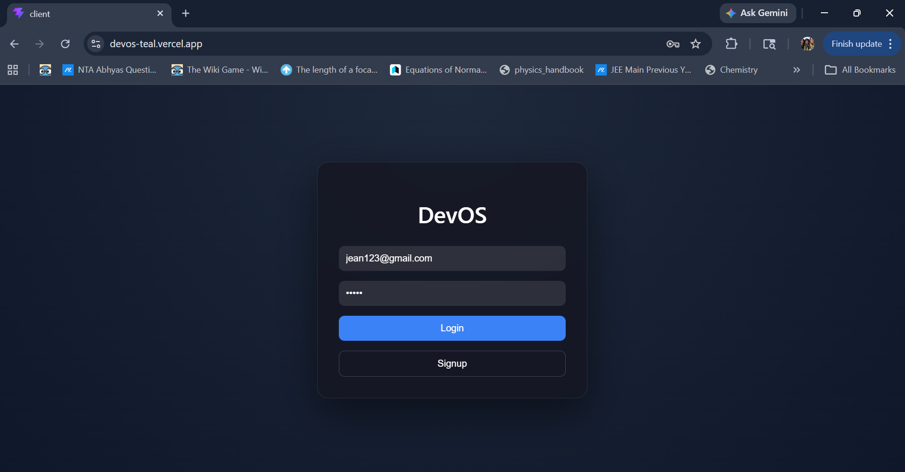
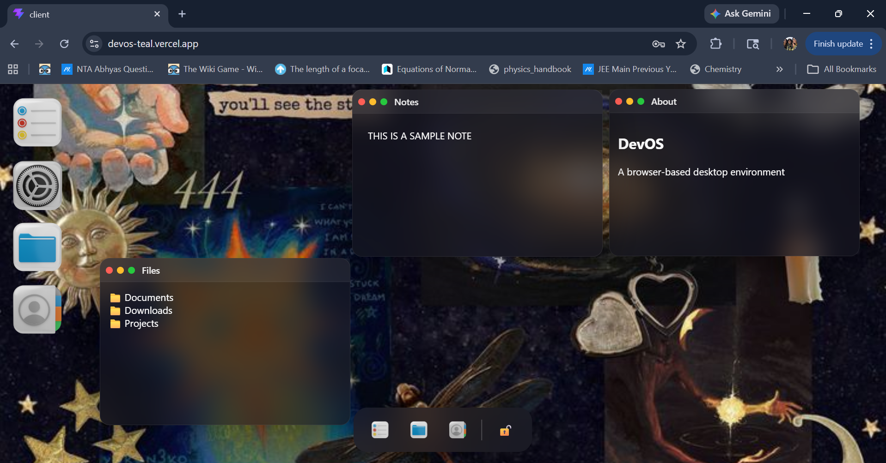

# DevOS

> A browser-based desktop environment that feels like a real OS.

DevOS is a fully interactive web desktop where users can open apps, manage notes, customize wallpapers, and experience a minimal OS-like interface — all inside the browser.

---

## Features

* 📝 **Window System** — draggable, focus-based layering
* 📝 **Persistent Notes** — auto-save locally + backend sync
* 🎨 **Custom Wallpapers** — user-controlled background
* 📝 **State Persistence** — remembers your setup
* 📝 **Authentication** — login/signup system
* 🧩 **App System** — Notes, Settings, Files, About
* 📝 **macOS-style Dock UI** — clean, minimal, icon-based

---

##  Demo

 Live App: *https://devos-teal.vercel.app/*
 Backend API: *https://dev-os.onrender.com*

---

##  Tech Stack

**Frontend**

* React (Vite)
* Framer Motion
* Custom CSS (glassmorphism + dock UI)

**Backend**

* Node.js + Express
* MongoDB
* JWT Authentication

---

## Inspiration

Inspired by macOS UI and the idea of bringing a **personal desktop experience to the browser**.

---

## Getting Started (Local Setup)

### 1. Clone the repo

```bash
git clone https://github.com/nabeehakappan/Developer-OS.git
cd Developer-OS
```

### 2. Setup backend

```bash
cd server
npm install
npm run dev
```

Create a `.env` file:

```
PORT=5000
MONGO_URI=your_mongo_uri
JWT_SECRET=your_secret
```

---

### 3. Setup frontend

```bash
cd client
npm install
npm run dev
```

---

## Environment Variables

| Variable   | Description        |
| ---------- | ------------------ |
| MONGO_URI  | MongoDB connection |
| JWT_SECRET | Auth token secret  |
| PORT       | Server port        |

---

## Deployment

* Frontend → Vercel
* Backend → Render

Make sure to update API base URL after deployment.

---

## Screenshots

1. Authentication and Authorization Page:


2. The UI of the dummy-OS


---


## Known Limitations

* File system is basic (no upload yet)
* No PDF editing (planned)
* Single-user desktop session per login

---

## Roadmap

*  File uploads + preview
*  Document viewer (PDF, text)
*  Dock magnification effect
*  Window snapping + resizing
*  Full cloud sync

---

##  Author

Built by **Nabeeha Kappan**

---

##  Final Thought

This isn’t just a UI project — it’s the foundation of a browser-based operating system.

---

